::: {style="text-align: right;"}
[](https://www.gnu.org/licenses/agpl-3.0.en.html) [](http://creativecommons.org/licenses/by-sa/4.0/)
:::

For the YouTube livestream schedule, see [here](https://www.youtube.com/@cytometryinr)

For screen-shot slides, click [here]()

{width="50%"}

<br>

---

# Background

There are different ways to unmix spectral flow cytometry data. [Autospectral](https://github.com/DrCytometer/AutoSpectral) is one of them, with the methodology behind the approach explained in this 2025 [pre-print](https://www.biorxiv.org/content/10.1101/2025.10.27.684855v1) by [Oliver Burton](https://github.com/DrCytometer) et al.

## Logistics

## Method

# Walk-through

## Installation

I recommend starting off by [installing](/course/01_InstallingRPackages/index.qmd#install-from-github) both the `AutoSpectral` and its associated `AutoSpectalRcpp` package (which allows for accelerated unmixing via C++ code) at the same time. Since both are available via [GitHub](https://github.com/DrCytometer), they can be installed using either the `remotes` or `pak` packages. 

```{r}
#| eval: FALSE
remotes::install_github("DrCytometer/AutoSpectral")
remotes::install_github("DrCytometer/AutoSpectralRcpp")

pak::pkg_install("DrCytometer/AutoSpectral")
pak::pkg_install("DrCytometer/AutoSpectralRcpp")
```

Please note, if you are on a **MacOS** or **Linux** operating system, to install `AutoSpectralRcpp` you will likely need to configure some system settings first to allow you to make full use of `OpenMP` (as mentioned by Oliver in the `AutoSpectralRcpp` [README](https://github.com/DrCytometer/AutoSpectralRcpp#installation)). 

On Debian Linux (Trixie), the steps to are summarized below

First, create and open a personal ~/.R/Makevars file via your terminal

```{r}
#| eval: FALSE

# bash/shell code
mkdir .p ~/.R
nano ~/.R/Makevars
```

Edit the file by entering the file, before saving the changes and exiting. 

```{r}
#| eval: FALSE

# bash/shell code
CXX_STD = CXX17
PKG_CXXFLAGS = -fopenmp
PKG_LIBS = -fopenmp -llapack -lblas
```

Once the Makevars file has been updated, proceed with installing `AutoSpectralRcpp`. 

## Dataset

For this walkthrough, the spectral flow cytometry .fcs files being used were generated in 2025 as part of the yearly [5-day training workshop](https://umgccfcss.github.io/BISCC_2025/Day1_5L.html) here at [UMGCCC FCSR](https://www.medschool.umaryland.edu/cibr/core/umgccc_flow/). The panel consisted of 5 markers (CD45, CD3, CD4, CD8 and Viability). This panel was used to stain mouse splenocytes, which were then acquired on a 5-laser Cytek Aurora. These .fcs files were [substantially downsampled](/course/community/TRU-OLS/FCSCleanUp.qmd) in order to pass the GitHub size limits for sharing as part of this example. 

## Set Up

Similar to it's [predecessor](https://github.com/carlosproca/autospill) `autospill`, some of the `AutoSpectral` functions are a bit opinionated on where folders and files should be in relation to the working directory. Rather than encountering a bug that might be difficult to troubleshoot, I recommend just creating a new project folder in which you will primarily be carrying out the unmixing. In this scenario, all created folders and files end up at the top-level of your projects working directory. 

To get started, first attach `AutoSpectral` to your local environment the required R packages via the `library()` call

```{r}
library(AutoSpectral)
library(AutoSpectralRcpp)
library(dplyr)
```

## Locate .fcs files

Next off, specify the storage location of the .fcs files. In the case of todays example data, the unmixing controls and full-stained samples are present in their own respective subfolders within "data". Additionally, provide a file.path to a folder where you want the unmixed .fcs files to be saved to. 

```{r}
# StorageLocation <- file.path("course", "community", "AutoSpectral", "data") 
StorageLocation <- file.path("data") # For Quarto Render

# OutputLocation <- file.path("course", "community", "AutoSpectral", "outputs")
OutputLocation <- file.path("outputs") # For Quarto Render
```


## asp

`AutoSpectral`, like its [predecessor](https://github.com/carlosproca/autospill) package `autospill`, primarily utilizes an "asp" list object for use in specifying default arguments for subsequent unmixing. 

Main things to specify is the spectral cytometer used (currently consisting of "aurora", "auroraNL", "id7000", "a8", "s8", "a5se", "opteon", "mosaic" and "xenith") and whether you want the plots to be saved as figures within their respective folders. 

Since this dataset was from a Cytek Aurora, and generally the more visual data we have to ensure the gates were set properly the better, we will go with 

```{r}
#| eval: FALSE
asp <- get.autospectral.param(
  cytometer = "aurora",
  figures = TRUE 
)
```

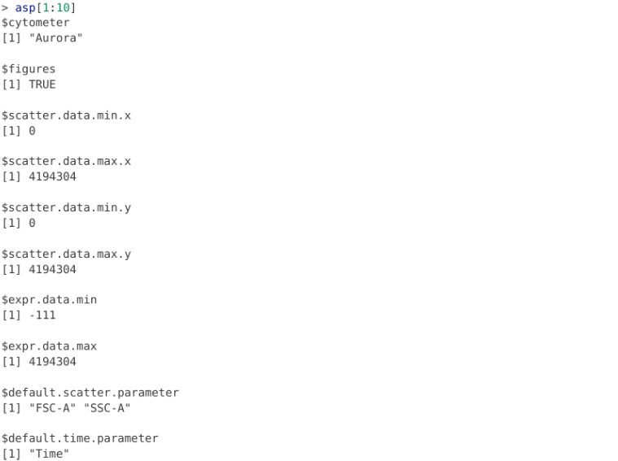

## Control File

### Creating the Control File

Next up, we will assemble the Control File, which is the .csv file that allows us to dictate what background is substracted from each of the singe-color controls. 

To get started, we need to provide the file.path to the directory that contains our unmixing controls (primarily single-color + 1 unstained). 

```{r}
control.dir <- file.path(StorageLocation, "unmixing_controls")
```

Alongside our already generated "asp" list, we can pass these as arguments to the `create.control.file()` to create the "fcs_control_file.csv"

```{r}
#| eval: FALSE
create.control.file(control.dir, asp)
```

As the code runs, `AutoSpectral` checks the fluorophore names against a reference database. If it matches a known fluorophore name, this will be used to prefill in some of the columns in the control file. If a fluorophore is not present in the database, a warning message will be outputted to the console window. In case of a new fluorophore that is not present in the database, you would then need to manually fill the corresponding information. 

In our case, it didn't find a matching name for our unstained, which is expected, as it is not a fluorophore to begin with. 

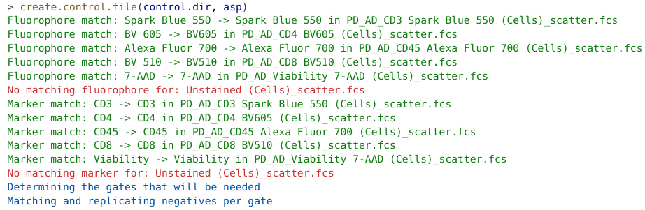

The resulting control file ends up being written directly to the top-level of our working directory (similar to how it was done with `autospill`). 

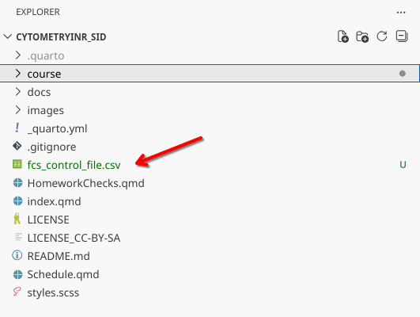

:::{.callout-note}
Since we created a new project folder for unmixing, this is expected and the files should remain at the top-level of the working directory. 

In the case of the wesite example, I copied these outputs over to the "outputs" folder for documentation and to allow the website to build correctly 
:::

Lets quickly visualize the contents of the Control File

```{r}
#| eval: FALSE
CSVFile <- list.files(pattern="fcs_control_file.csv",
  full.names=TRUE) # For You
```

```{r}
#| include: FALSE
CSVFile <- list.files(OutputLocation,
 pattern="fcs_control_file.csv", full.names=TRUE) # For Website

ControlFile <- read.csv(CSVFile, check.names=FALSE)
```

```{r}
ControlFile
```

The main structural elements to the control file are the following columns

- filename: The actual .fcs filename
- fluorophore: The name of the fluorophore (or AF in case of the unstained)
- marker: The name of the marker (or left empty in the case of the unstained)
- channel: The peak detector channel of the fluorophore (left empty for the unstained). In case the fluorophore is not present in the reference library, you will need to specify this manually
- control.type: Whether the unmixing control is cells or beads (used for matching positive and negatives for background subtraction)
- universal.negative: By default empty, if you want to use an universal negative, copy the filename of the corresponding unstained into this spot on a per fluorophore basis
- large.gate: Logical value, by default FALSE, set to TRUE to expand the gating area (more details later)
- gate.name: Gate name for use in signature retrievel (more details later)
- gate.define: Logical, permits you to set the general gate region as defined by gate.name
- is.viability: Whether your control is a viability dye. In this case, correctly identified 7-AAD from reference database so is already set to TRUE. 

### Editing the Control File

In this case, the reference databse correctly set most things at setup, so only a handful of manual interventions are needed. Primarily, we will be using the universal.negative option, so we will need to copy the filename of our Unstained ("Unstained (Cells)_scatter.fcs") to fill the empty slots in the universal.negative column. If you were editing the data.frame in R, you could do this for the entire column as follows

```{r}
ControlFile$universal.negative <- "Unstained (Cells)_scatter.fcs"
```

At the time of this walk-through, `AutoSpectral` failed to parse the channel information correctly for 7-AAD (showing up only as YG4 instead of YG4-A), so we will go ahead and also correct this

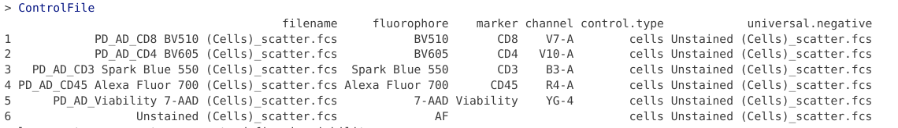

```{r}
ControlFile <- ControlFile |> 
  mutate(channel = case_when(
    fluorophore == "7-AAD" ~ "YG4-A",
    TRUE ~ channel
  ))
```

```{r}
ControlFile
```

For both the Unstained and CD45, I will also set the gate.define argument to FALSE for now.  

```{r}
ControlFile <- ControlFile |> 
  mutate(gate.define = case_when(
    marker == "CD45" ~ FALSE,
    fluorophore == "AF" ~ FALSE,
    TRUE ~ gate.define
  ))
```

```{r}
ControlFile
```

Lastly, I wish to rename the gate.names, preferring to use "lymphocytes" and "dead" as terms vs. "smallGate", "viabilityGate" respectively. Since all these markers are primarily lymphocyte markers, I will overwrite everthing as "lymphocytes", before using `dplyr`'s `case_when()` function to selectively set 7-AAD's value for gate.name to "dead"

```{r}
ControlFile$gate.name <- "lymphocytes"

ControlFile <- ControlFile |> 
  mutate(gate.name = case_when(
    fluorophore == "7-AAD" ~ "dead",
    TRUE ~ gate.name
  ))
```

```{r}
ControlFile
```

### Saving the Control File

Unfortunately, we are not currently able to pass the data.frame object directly to the `AutoSpectral` functions, so we will need to save our changes as an updated .csv file. This does have the benefit of permitting us to reuse the Control File again in the future. As always, saving under a new name to the working directory is recommended 

```{r}
#| eval: FALSE
UpdatedName <- "fcs_control_file_updated.csv"

StoreHere <- UpdatedName # For You
write.csv(ControlFile, StoreHere, row.names=FALSE) # For You
```

```{r}
#| include: FALSE
UpdatedName <- "fcs_control_file_updated.csv"
StoreHere <- file.path(OutputLocation, UpdatedName) # For Website
write.csv(ControlFile, StoreHere, row.names=FALSE) # For Website
```

### Checking the Control File

With the Control File now generated and edited, we can pass it to the `check.control.file()` function to verify that it is correctly formatted so that we can proceed to the next step. In our case, once we fixed the 7-AAD YG4 column, we had no issues and could proceed. 

```{r}
#| eval: FALSE

control.file <- StoreHere

check.control.file(control.dir, control.def.file=control.file, asp)
```

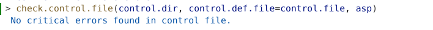

## Gate Landmarks

`Autospectral` utilizes the same approach for automated gating as `autospill`, simply, fracturing the plot area, identifying areas of density, and iteratively honing in. While this can often work, as is always the case with flow cytometry, there are exeptions. 

One way to work around this issue is to use the `define.gate.landmarks()` function, which references the Control File, identifies the peak detectors of fluorophores that are set to use a particular gate.name, and identifies the FSC-SSC location for cells with the brightest MFI for these designated detectors. This functionally serves as a landmark around which the gate is then placed. 

For our example below, gate.name="lymphocytes" is used by most of the fluorophores, which are utilized in the cross-check. Consequently, when we run `define.gate.landmarks()` for "lymphocytes", we see the following

```{r}
#| eval: FALSE
gate.lymphocyte <- define.gate.landmarks(
  control.file = control.file,
  control.dir = control.dir,
  asp = asp,
  n.cells = 2000,
  percentile = 70,
  gate.name = "lymphocytes"
)
```

This results in a new folder being created in the working directory, containing both the gating landmark parameters

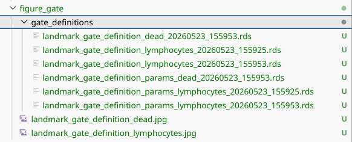

As well as the corresponding plot for each gate.name

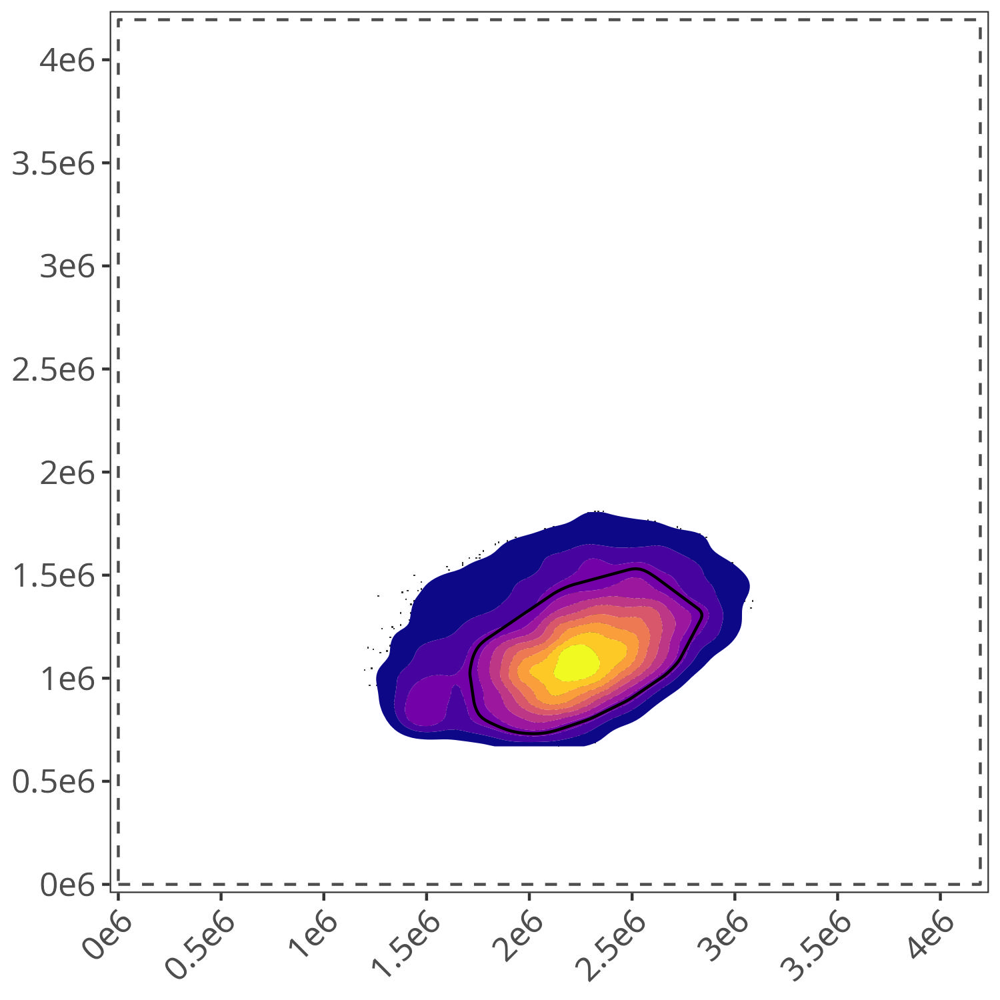

Similarly, 7-AAD is the only fluorophore used with gate.name="dead", so the location of the brightest YG4-A cells ends up serving as the the landmark. 

```{r}
#| eval: FALSE
gate.dead <- define.gate.landmarks(
  control.file = control.file,
  control.dir = control.dir,
  asp = asp,
  n.cells = 2000,
  percentile = 70,
  gate.name = "dead"
)
```

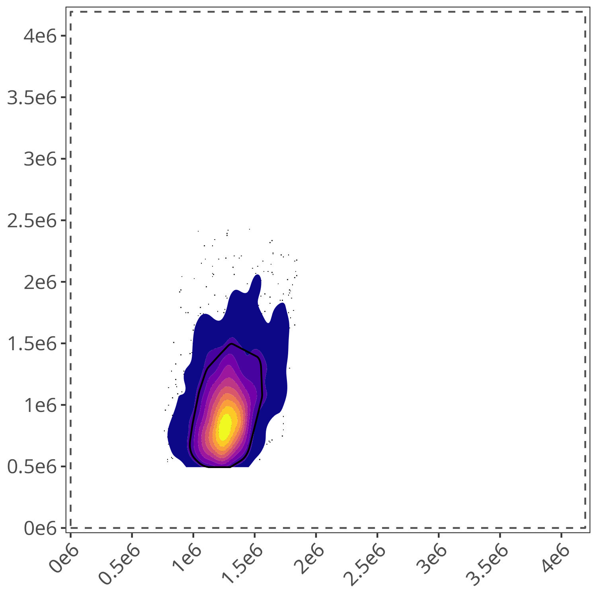

Since both plots match my expectations of the location of "lymphocyte" and "dead" cells for this dataset, we can proceed to the next step. 

## Define Flow Control 

With these initial structural elements assembled, `AutoSpectral` focus shift to the process of preparing the single-colors for signature isolation. Two important pre-processing steps that are utilized to ensure this is carried out properly. One of these is to match the gated area of the positive single-color control with the corresponding gating area in the negative unstained control. This "hopefully" would ensure that the background autofluorescence being substracted comes from the same cell type(s) and is more-similar-than-not. 

To do this, we first need to assemble a list of the gate.names that are present for our panel. In our case, we only defined "lymphocytes" and "dead", so we will only include those. Vice versa, if you also had a "monocyte" and "bead" gated region, you would include these as well. 

```{r}
#| eval: FALSE
my.gates <- list(
  "lymphocytes" = gate.lymphocyte,
  "dead" = gate.dead
)
```

We then pass this "my.gates" list, our "asp" list, and the edited Control File to the `define.flow.control()` function. This then orchestrates the matching and drawing of gates for each fluorophore. 

```{r}
#| eval: FALSE
flow.control <- define.flow.control(
  control.dir = control.dir,
  control.def.file = control.file,
  asp = asp,
  gate.list = my.gates,
  color.palette = "rainbow"
)
```

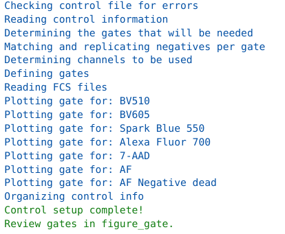

We end up with a flow.control variable, which consist of . Additionally, we also have a figure_gate folder containing the visualized plots for the individual fluorophores. Lets take a closer look

7-AAD

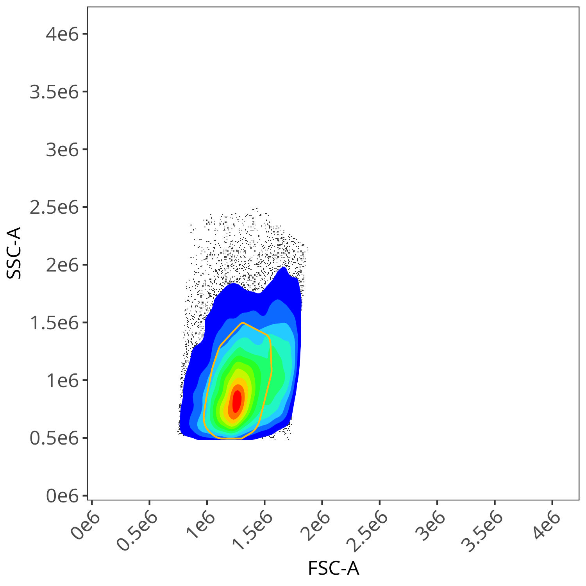

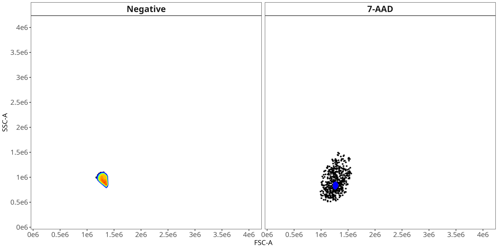

BV510

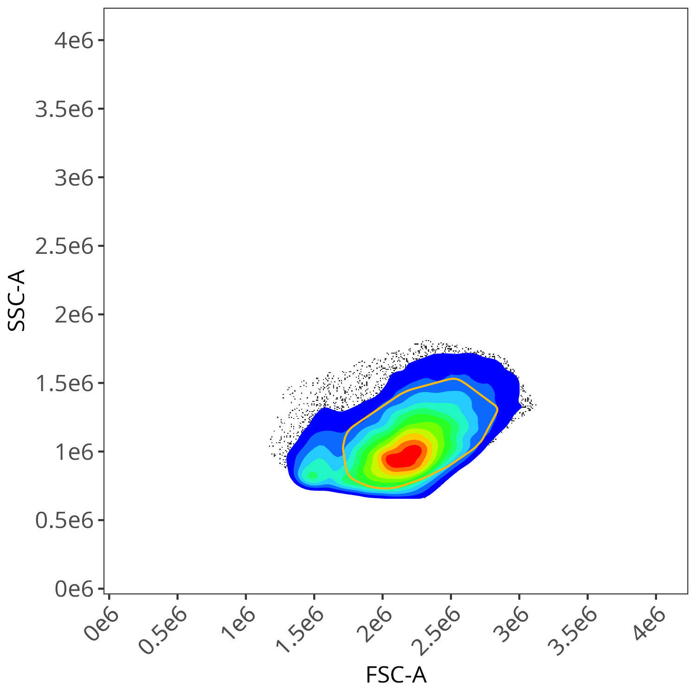

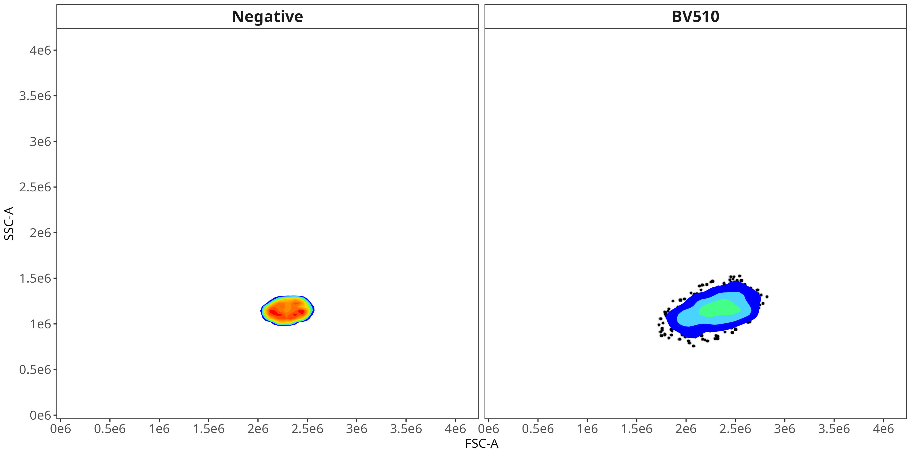

BV605

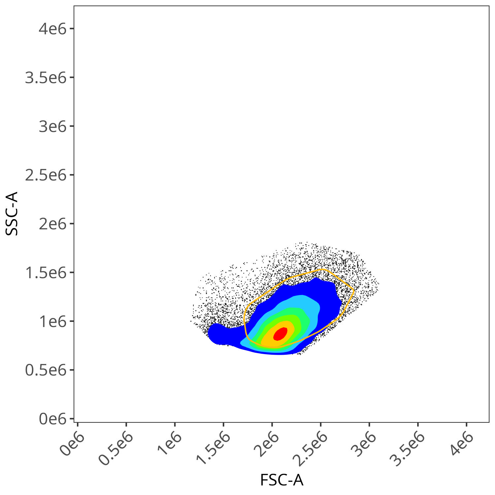

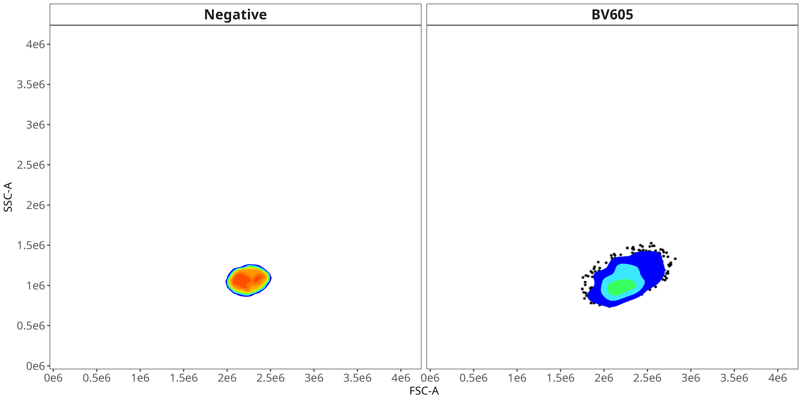

Alexa Fluor 700


Spark Blue 550


And autofluorescence for live cells

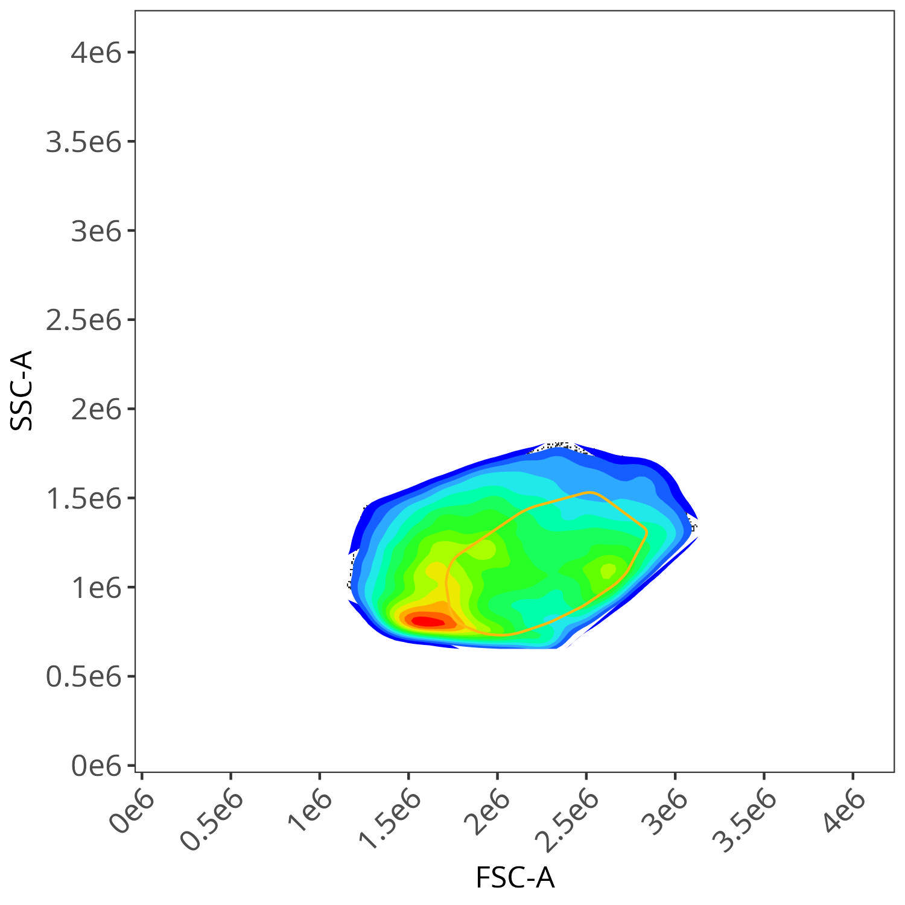

And autofluorescence for dead cells


As you may notice, the FSC-SSC coordinates being used by both the positive single-color and negative unstained are matching for subsequent use in the signature isolation. 


## Clean Control

The other important step in preparing the single-colors for signature isolation is identifying and separating out from the fluorophore-stained cells any variant autofluorescence that might be present in the .fcs files. This is an especially important step for cells where multiple mixed autofluorescence signatures may be present (ex. lung)

This is mediated through the use of the `clean.controls` function, to which we pass our flow.control and asp objects. 

```{r}
#| eval: FALSE
flow.control <- clean.controls(flow.control, asp) # Figure Clean Controls
```

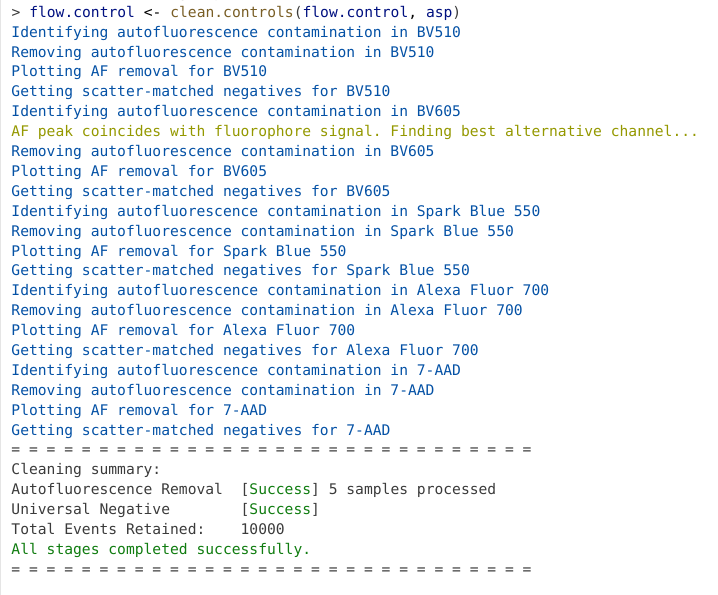

As we can see from the output, `clean.controls()` first identifies and removes the variant autofluorescence, before generating the visual plots. It then gathers the scattered-matched negatives for the respective fluorophore to calculate out the signature now that potential variant autofluorescence is no longer present. 

In the case of this dataset (originating from spleen), the effect was not as obvious for many of the fluorophores, although we can see the effect for BV510. From the plotted region, we can see the variant autofluorescence cells that were removed present in the gated region

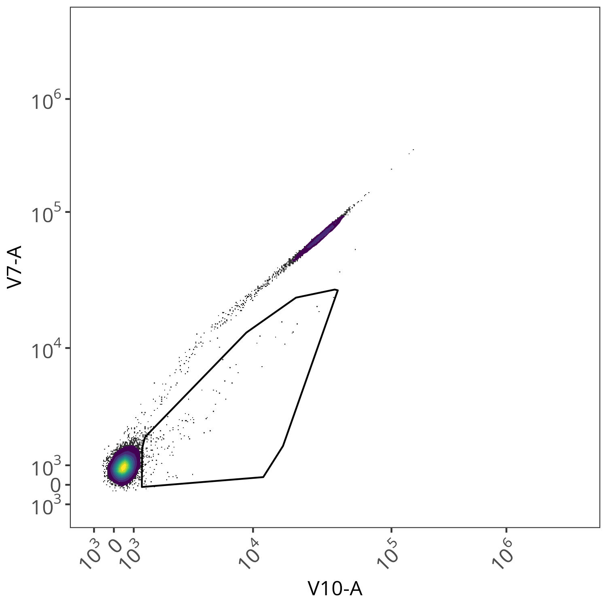

And looking at the resulting impact on the signature, we see we end up with less outlier contributions for the Blue, Yellow-Green and Red detectors. 

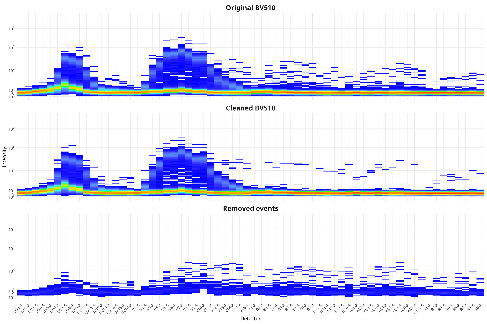

## Spectra

Now that the single-color unmixing controls are matched to the corresponding FSC-SSC coordinates of the unstained, and variant autofluorescences are removed, `AutoSpectral` proceeds to calculate the fluorescent spectral signatures for each, before assembling them into a signature matrix. 

```{r}
#| eval: FALSE
spectra <- get.fluorophore.spectra(flow.control, asp) #Figure Scatter #Figure Spectra
```

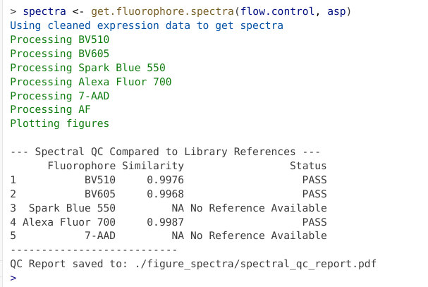

If the signature is available via the reference database, a quick QC is carried out to make sure the signature is comparable to the reference (helping to screen for mistaken identity issues, etc). 

If we check our spectra object, we can see the underlying data for each signature. This is also saved to the  "table_spectra" folder containing the .csv file

```{r}
#| eval: FALSE

SpectraTablePath <- "table_spectra" # For You

SpectraCSV <- list.files(path=SpectraTablePath,
  pattern="Clean_autospectral_spectra.csv", full.names=TRUE)  # For You

SpectraCSVData <- read.csv(SpectraCSV, check.names=FALSE)
```

```{r}
#| include: FALSE
SpectraTablePath <- file.path(OutputLocation, "spectra") # For Website
SpectraCSV <- list.files(path=SpectraTablePath, 
pattern="Clean_autospectral_spectra.csv", full.names=TRUE)  # For Website

SpectraCSVData <- read.csv(SpectraCSV, check.names=FALSE)
```

```{r}
SpectraCSVData
```


In the process, the plotted figures are stored to the "figure_spectra" and "figure_similarity" folders. Among the plots of interest, we get back the plotted normalized spectral signatures

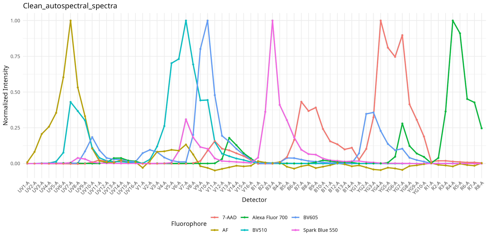

A similarity matrix containing the cosine values when comparing one fluorophore against another

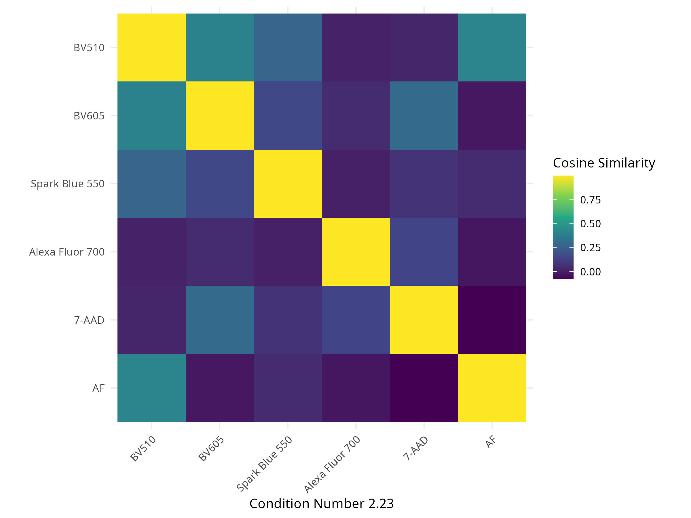

A spectral heatmap showing intensity  across detectors for each fluorophore (corresponding to the peak detector and relative height of the other detectors)


And the coefficients, which will play a role later on. 


Additionally, there is a .pdf report with the plotted extracted signatures vs. the reference

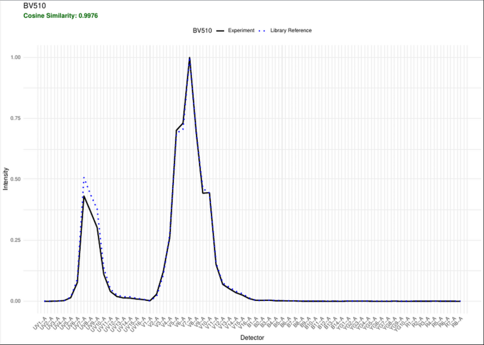


## Unmixing

Now that all the pre-requisites have been assembled, we can now leverage them to unmix the full-stained .fcs files. To do this, lets first provide the file path to their respective folder. 

```{r}
FullStainedPath <- file.path(StorageLocation, "samples")
```

Additionally, lets drop the row containing the AF from the spectra object, as different unmixing methods will handle the autofluorescence differently. 

```{r}
#| eval: FALSE
rownames(spectra)
no.af.spectra <- spectra[ !(rownames(spectra) == "AF"),]
rownames(no.af.spectra)
```

### OLS 

`AutoSpectral` has 4 ways to perform unmixing. One of these is Ordinary Least Squares (OLS), which is what most of the spectral flow cytometry unmixing R packages have as a default. While the option exist to unmix individual files, I prefer to use the `unmix.folder` function to unmix all at the same time. When `AutoSpectralRcpp` is installed, we can take advantage by setting parallel equal to TRUE, and specifying the number of core threads to allocate for the process (this will vary based on your computers CPU specifications). 

```{r}
#| eval: FALSE

unmix.folder(
  fcs.dir = FullStainedPath,
  spectra = spectra,
  asp = asp,
  flow.control = flow.control,
  method = "OLS", 
  parallel = TRUE,
  threads = 3,
  output.dir=OutputLocation
)
```

We can then quickly check to make sure everything looks normal to other users not using R for their analysis by opening the resulting .fcs files using commercial software or [Floreada.io](/course/00_Floreada/index.qmd)

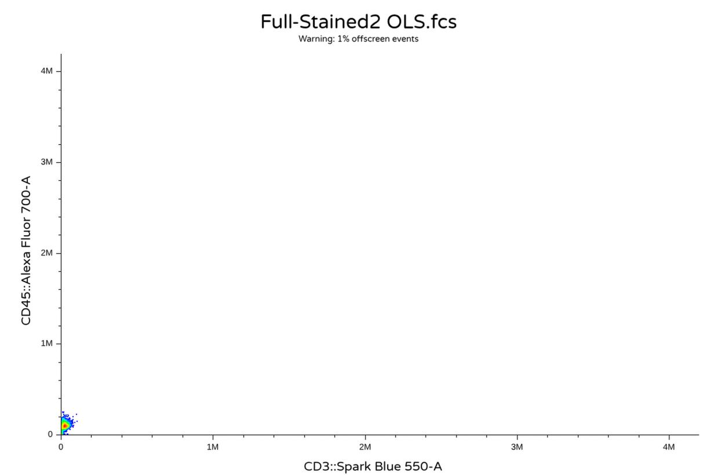

Oops! Looks like somewhere in the description/keyword list `AutoSpectral` still needs to have the P--DISPLAY keyword switched from Lin to Log. However, we can manually switch the axis over and apply a transformation, at which thing everything is back to looking as expected

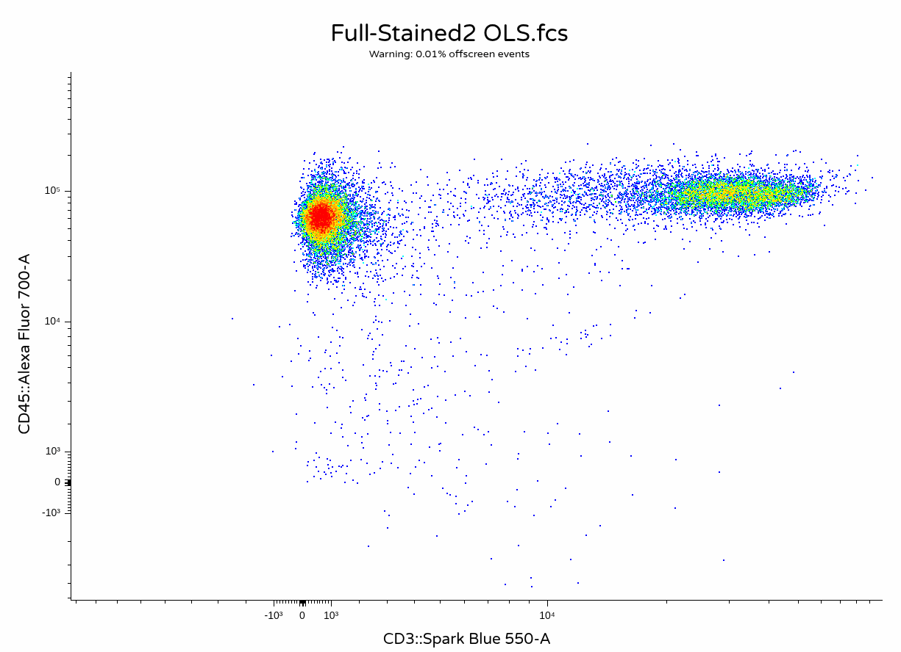

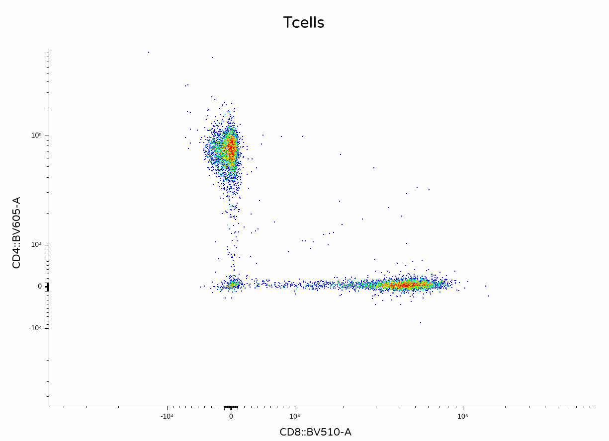

A small unmixing error for CD4+ T cells which are BV510 negative, but otherwise not bad considering this is a small not-complicated panel. On to the next method!

### WLS 

`AutoSpectral` also provides the option to unmix using Weighted Least Squares. For most cytometers, it mediates this by estimating residual variance across the detectors for each of the single colors (see [pre-print](https://www.biorxiv.org/content/10.1101/2025.10.27.684855v1) for the technical implementation details). 

The setup is essentially the same as with OLS, just switching out the method to instead use "WLS"

```{r}
#| eval: FALSE

unmix.folder(
  fcs.dir = FullStainedPath,
  spectra = spectra,
  asp = asp,
  flow.control = flow.control,
  method = "WLS", 
  parallel = TRUE,
  threads = 3,
  output.dir=OutputLocation
)
```

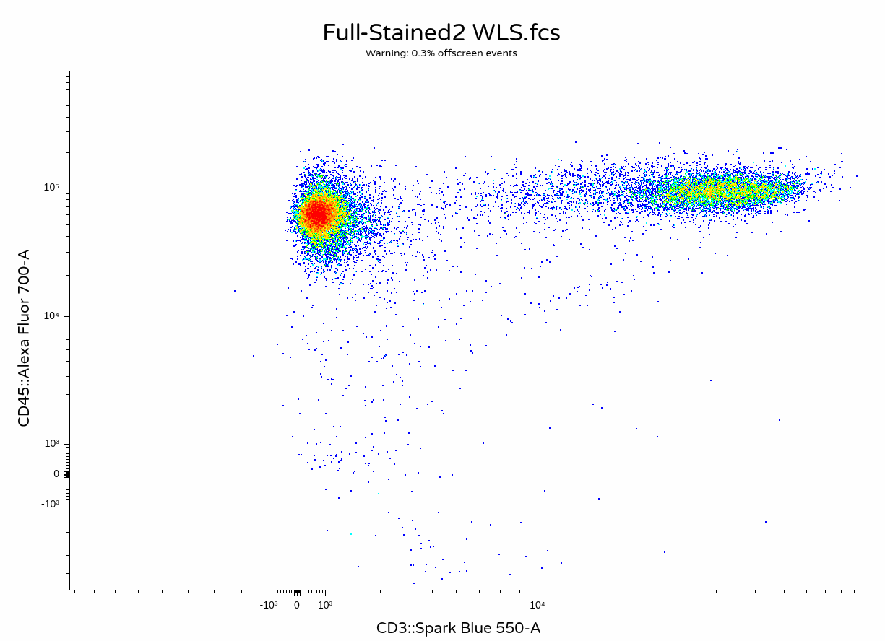

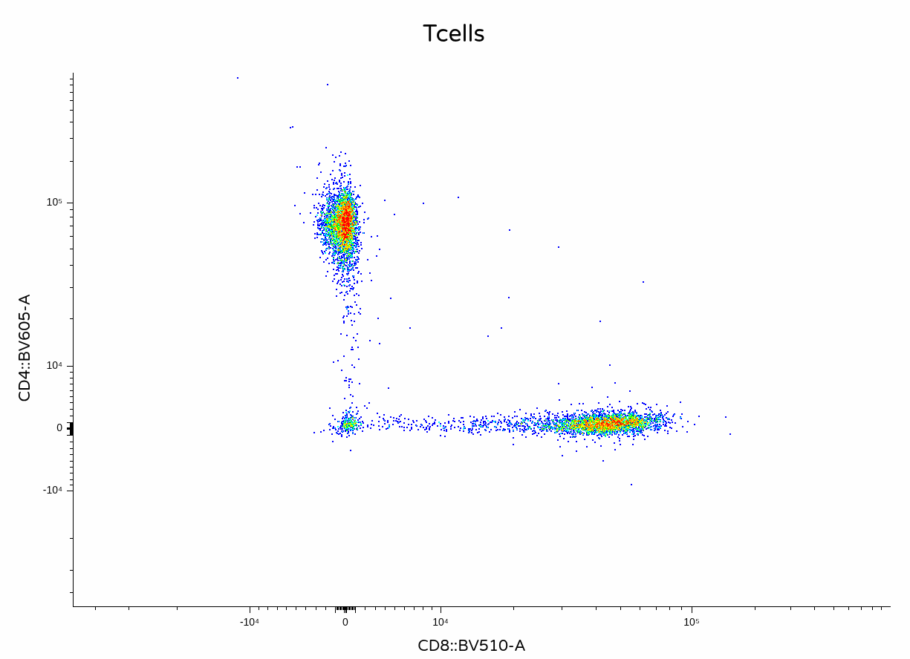

In this case, the unmixing error on the CD4+ T cells is a little less noticeable than previously. 

### Per-cell AF extraction

Beyond better signature isolation from the single-color controls (by negative matching and removing variant autofluorescence in advance), `AutoSpectral` attempts to handle the issue of multiple autofluorescence by isolating autofluorescence signatures from the unstained sample, and then determining at the individual cell level what autofluorescences are likely present. See the [pre-print](https://www.biorxiv.org/content/10.1101/2025.10.27.684855v1) for all the technical details behind the implementation. Namely, signatures are isolated, FlowSOM is utilized to identify the likely troublemakers, and then through iterative process what present individual cell determined via identifying least absolute variance for low-squared residuals. 

In practice, we need to provide the file.path to our unstained .fcs file to the `get.af.spectra` function. This unstained .fcs file path should match that of the corresponding tissue type as the full-stained sample being unmixed. 

```{r}
#| eval: FALSE

UnstainedPath <- file.path(StorageLocation, "unmixing_controls",
 "Unstained (Cells)_scatter.fcs")

spleen.af <- get.af.spectra(
  unstained.sample = UnstainedPath,
  asp = asp,
  spectra = spectra,
  refine = TRUE 
)
```

When this is then, we get back a few plot outputs to the autofluorescence folder. We can see all 100 unstained signature variants that ended up in the [FlowSOM](https://github.com/saeyslab/FlowSOM)


We can also visualize at which detectors these differences are most manifested. 


And via the heatmap get a rough idea of the overall heterogeneity gradient


Additionally, we can see how the iteration process of identifying autofluorescences for use in the unmixing plays out as the variance around the negative decreases going from no AF extraction, to first pass and second pass. 

.fcs%20_%20Autofluorescence%20spectra%20_No_AF_Extraction.jpg)

.fcs_Autofluorescence%20spectra_PerCell_AF_Extraction_First_Pass.jpg)

.fcs_Autofluorescence%20spectra_PerCell_AF_Extraction_Second_Pass.jpg)

Additionally, we get back a .csv contianing the fluorescent signatures for each of the variant autofluorescence signatures, which can be used for after-the-fact unmixing. 

To proceed, we modify the `unmix.folder()` function by switching method to "AutoSpectral", and providing some addition arguments.

```{r}
#| eval: FALSE

unmix.folder(
  fcs.dir = FullStainedPath,
  spectra = spectra,
  asp = asp,
  flow.control = flow.control,
  method = "AutoSpectral", 
  af.spectra = spleen.af,
  file.suffix = "per-cell AF extraction",
  parallel = TRUE,
  threads = 3,
  output.dir=OutputLocation
)
```

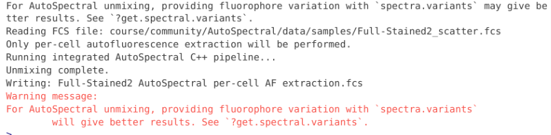

And last but not least, you can factor fluorophore signature variation as well. 

With everything successfully run, we can proceed and visualize the result on unmixing

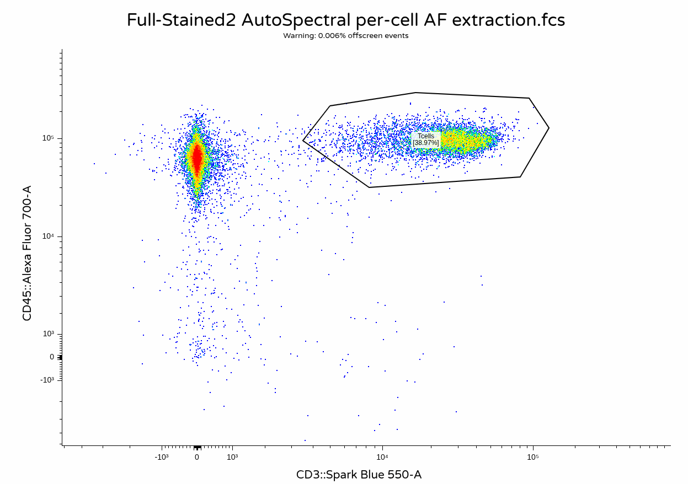

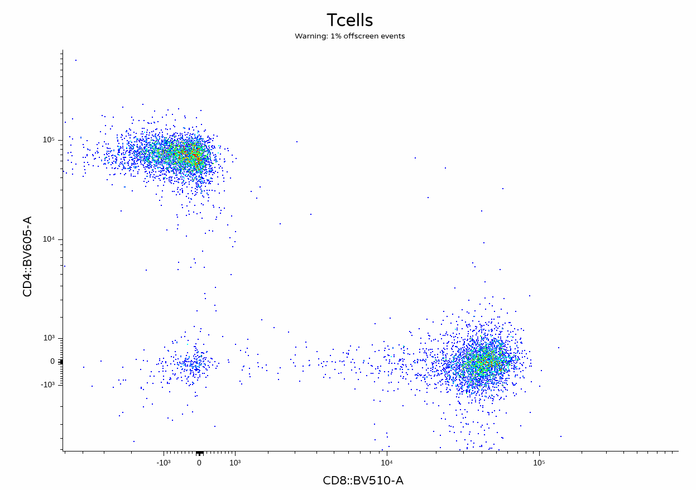

### Fluorophore optimization and per-cell AF

Finally, some of the variation in unmixing may be due to the fluorophores themselves shifting to a small degree (think of a smaller branch breaking off a larger tandem fluorophore). As long as above the cutoff (>0.98 on  cosine) `AutoSpectral` will attempt to estimate on a per-cell basis via a simialr mechanisms as was implemented to determine the autofluorescent variants. 

```{r}
#| eval: FALSE

variants <- get.spectral.variants(
  control.dir = control.dir,
  control.def.file = control.file,
  asp = asp,
  spectra = spectra,
  af.spectra = spleen.af, 
  parallel = FALSE, 
  refine = TRUE 
)
```

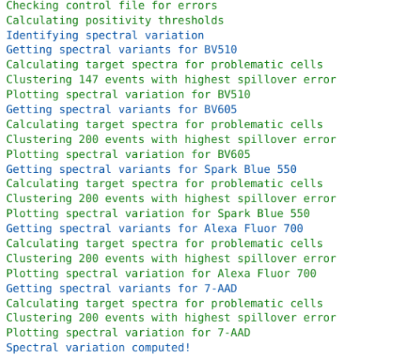

This in turn results with a compilation of signature variants for the individual fluorophores, which then gets integrated into the unmixing process as documented in the [pre-print](https://www.biorxiv.org/content/10.1101/2025.10.27.684855v1). For our dataset, individual fluorophores varied a bit in the extent this was an issue, as can be seen from the saved plots

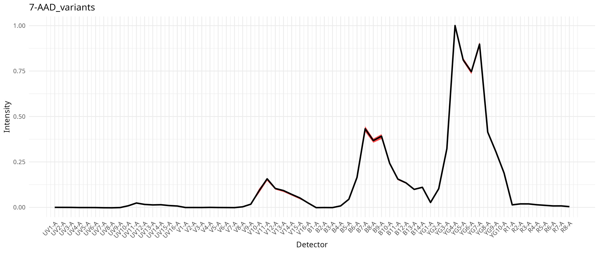


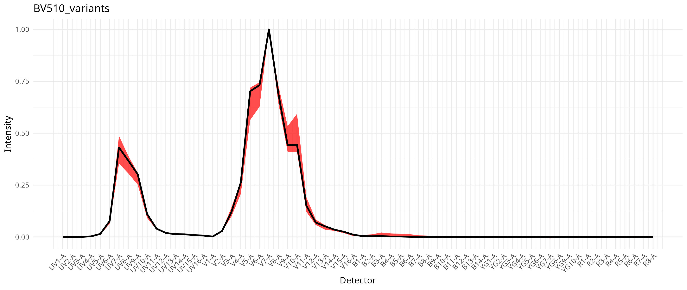

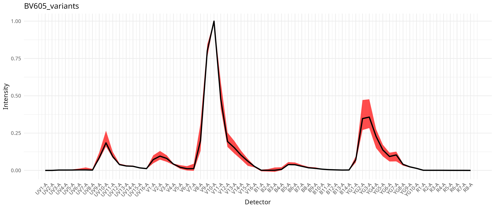

To run with per-cell AF extraction and fluorophore optimization, we still keep the method set to "AutoSpectral", but also provide a spectra.variants argument, passing in our variants object. 

```{r}
#| eval: FALSE

unmix.folder(
  fcs.dir = FullStainedPath,
  spectra = spectra,
  asp = asp,
  flow.control = flow.control,
  method = "AutoSpectral", 
  af.spectra = spleen.af,
  spectra.variants = variants,
  file.suffix = "per-cell AF and fluorophore optimization",
  parallel = TRUE,
  speed="slow",
  threads = 3,
  output.dir=OutputLocation
)
```

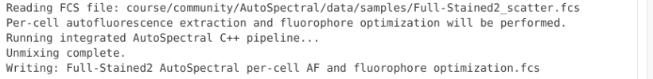

With the unmixing complete, we can now visualize the output .fcs files to contrast against the other unmixing methods. 

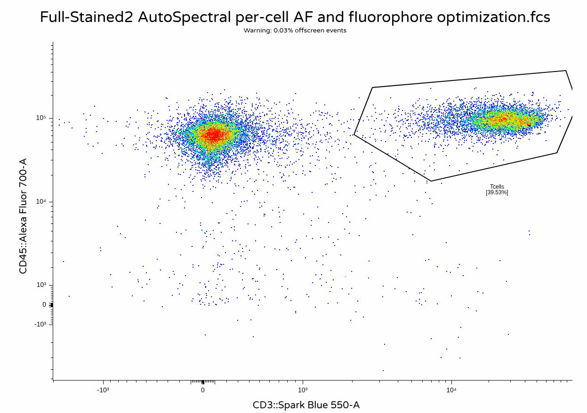

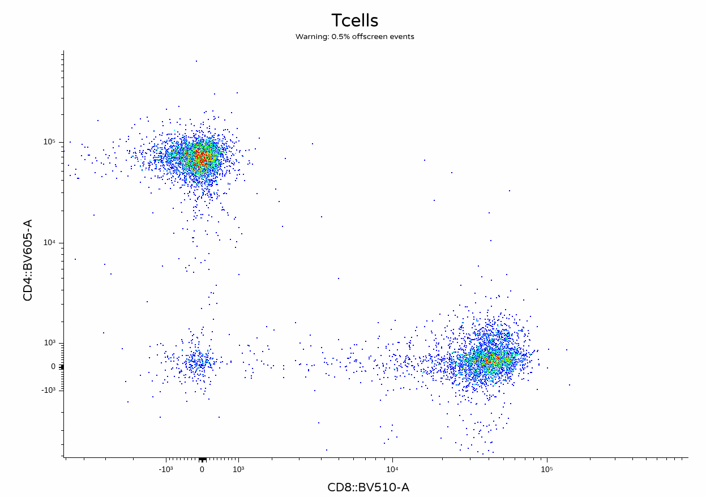


# Take Away

In this walk-through, we show-cased a simple implementation of the `AutoSpectral` workflow. Unlike many of the other R packages we have covered during the course, `AutoSpectral` is in no shortage of documentation, so I highly recommend checking out the additional resources links under the Additional Resources section. 

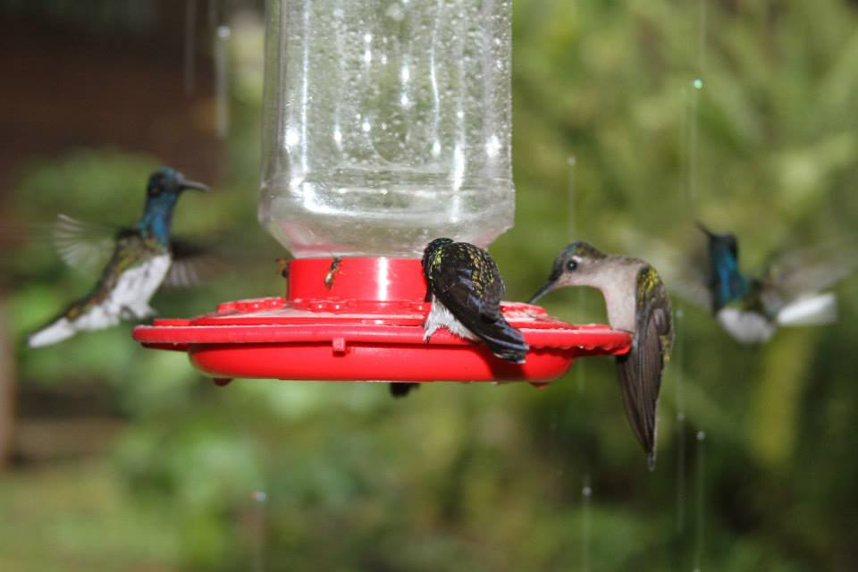

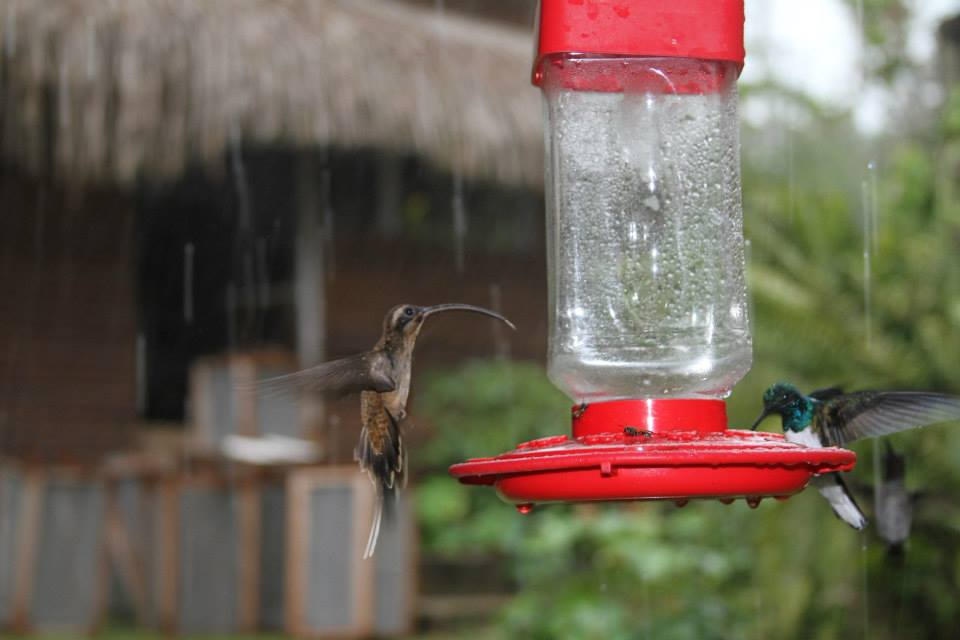

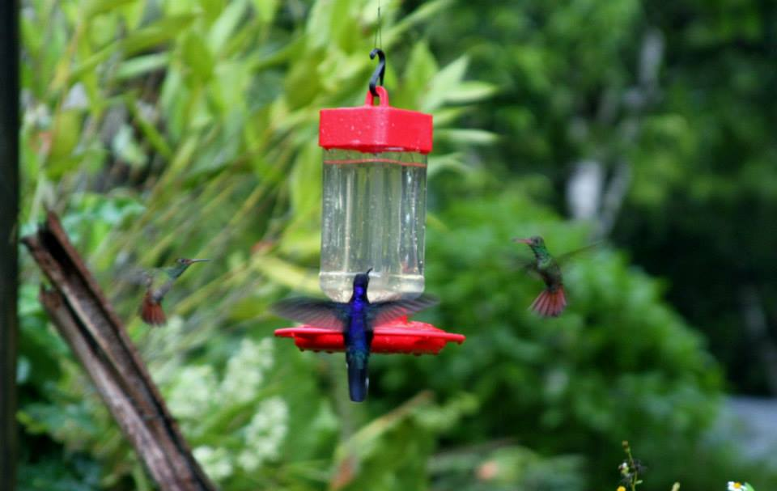


# Additional Resources

[AutoSpectral GitHub repository](https://github.com/DrCytometer/AutoSpectral) GitHub repository for AutoSpectral. Oliver Burton is active when it comes to both documentation and addressing any bugs encountered via the repository Issues page. 

[Autospectral Vignettes](https://drcytometer.github.io/AutoSpectral/) The pkdgown website with a total of 17 vignette articles covering the various finer details of how to use AutoSpectral.

[AutoSpectral Pre-Print](https://www.biorxiv.org/content/10.1101/2025.10.27.684855v1) The pre-print article describing the underlying methodology and all the finer details I am not qualified to explain.

[Colibri Cytometry](https://www.colibri-cytometry.com/search?q=AutoSpectral) Additional blogpost explainers that Oliver has written about AutoSpectral, some overlap with the vignettes, some completely new. 

```{r}
#| eval: FALSE
#| include: FALSE

print("Goodbye")
```

::: {style="text-align: right;"}
[](https://www.gnu.org/licenses/agpl-3.0.en.html) [](http://creativecommons.org/licenses/by-sa/4.0/)
:::
