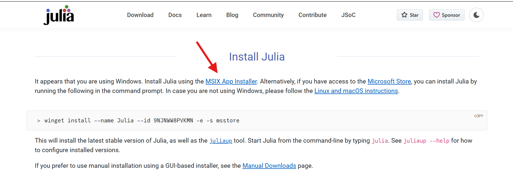
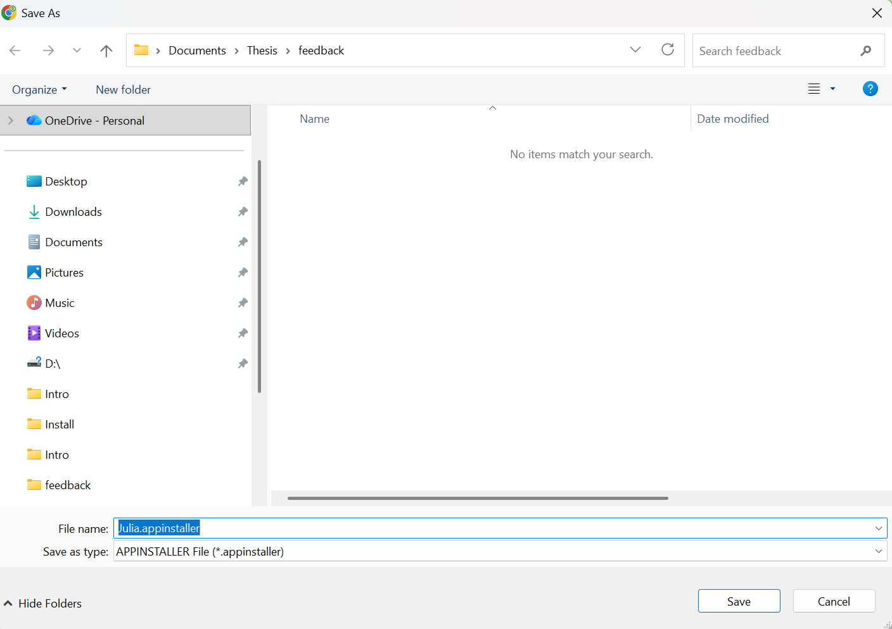
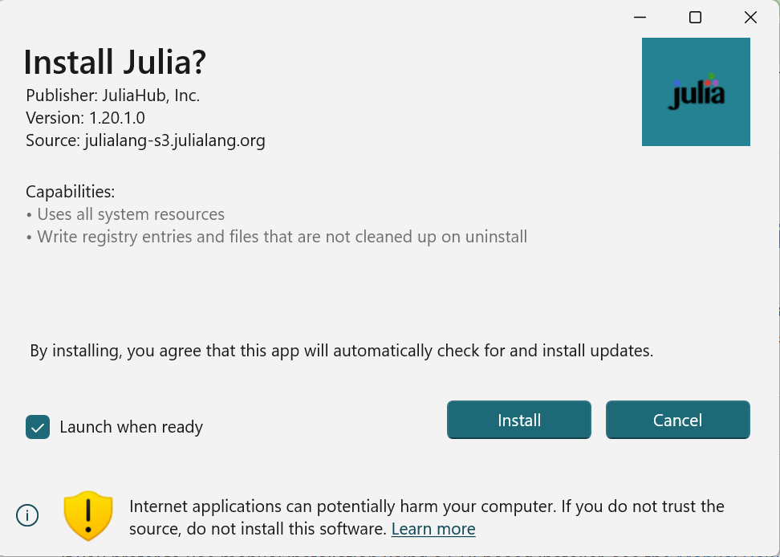
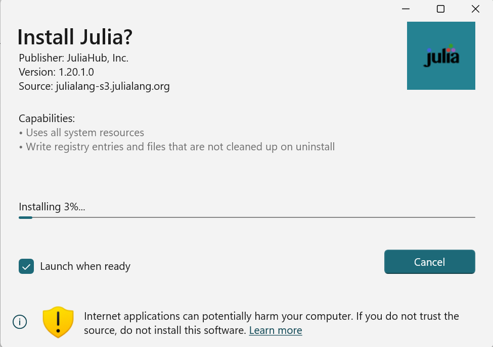
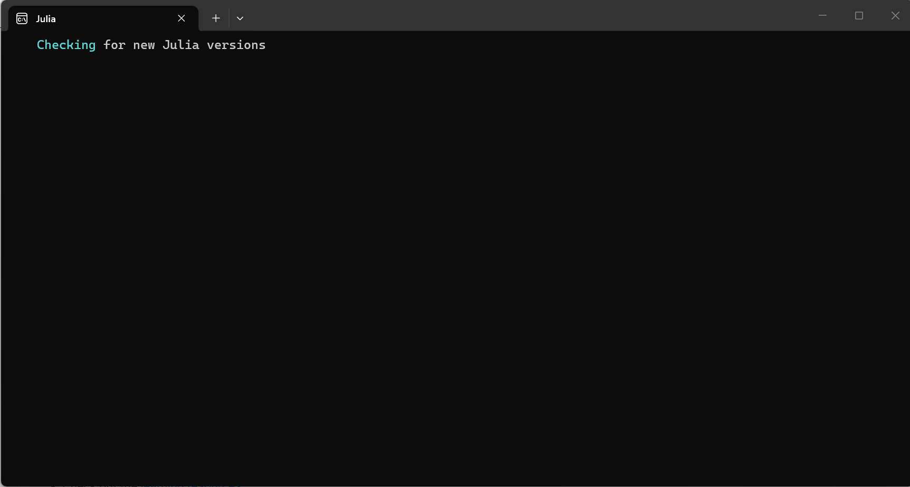
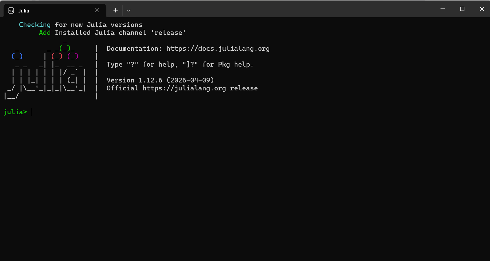

::: {style="text-align: right;"}
[](https://www.gnu.org/licenses/agpl-3.0.en.html) [](http://creativecommons.org/licenses/by-sa/4.0/)
:::

# Getting Started

To be able to use [TRU-OLS](https://github.com/De-Novo-Research/TRU-OLS) for unmixing spectral flow cytometry data, we will need to install the [Julia](https://julialang.org/) programming language on our computer. 

First, we will navigate to the Julia [homepage](https://julialang.org/) 


The installation instructions will then vary a bit depending on whether your computer is running a [Windows](/course/00_WorkstationSetup/Windows.qmd), [MacOS](/course/00_WorkstationSetup/MacOS.qmd) or [Linux](/course/00_WorkstationSetup/Linux.qmd)operating system. 

## Windows

When using a [Microsoft](/course/00_WorkstationSetup/MacOS.qmd) operating system, the Julia website will route you to this webpage, with instructions on how to download the installer.



Proceed to download the installer, and once downloaded, run it. 



Proceed with the installation



Wait for the installation to complete



After completion, the installer proceeds to open Julia and check for updates. 



You should see the Julia splash screen if everything installed correctly. 



## MacOS or Linux

When using either a [MacOS](/course/00_WorkstationSetup/MacOS.qmd) or [Linux](/course/00_WorkstationSetup/Linux.qmd) operating system, the Julia website will route you to this webpage, with instructions on how to install Julia via your terminal. 


Proceed to copy and run the following line of code in your terminal

```{r}
#| eval: FALSE

curl -fsSL https://install.julialang.org | sh
```


A dialogue tree similar to the one pictured below will then appear, describing what will be installed,  where, and a few additional details. When ready, proceed with the installation.


The installation and download will then proceed. 


Upon successful installation completion, you will see the following prompt. Run the lines of code to reload the path environment, before entering the `julia` in the terminal to make sure you can start a julia session. 


# Proceeding

At this point, you are ready to proceed with the rest of the TRU-OLS walk-through. Click [here](/course/community/TRU-OLS/index.qmd#downloading-tru-ols) to be redirected.

::: {style="text-align: right;"}
[](https://www.gnu.org/licenses/agpl-3.0.en.html) [](http://creativecommons.org/licenses/by-sa/4.0/)
:::

